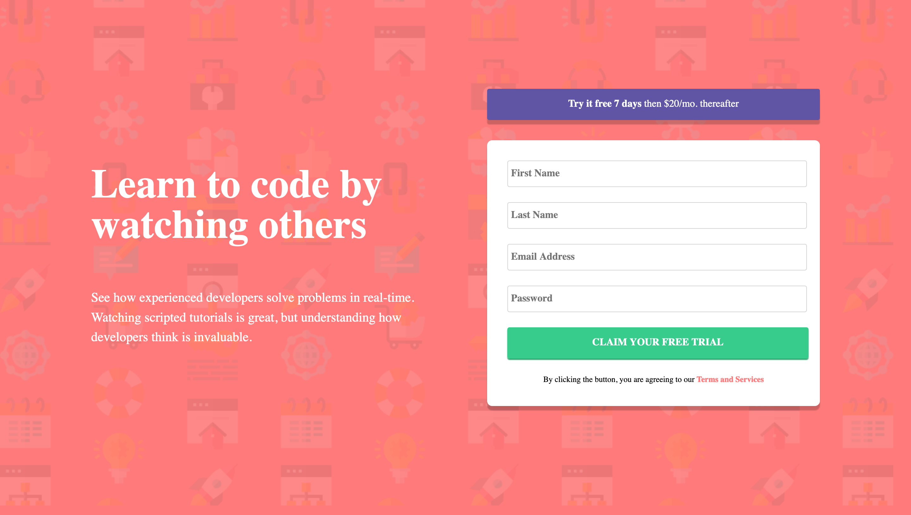

# Frontend Mentor - Intro component with sign up form solution

This is a solution to the [Intro component with sign up form challenge on Frontend Mentor](https://www.frontendmentor.io/challenges/intro-component-with-signup-form-5cf91bd49edda32581d28fd1). Frontend Mentor challenges help you improve your coding skills by building realistic projects.

## Table of contents

- [Overview](#overview)
  - [The challenge](#the-challenge)
  - [Screenshot](#screenshot)
  - [Links](#links)
- [My process](#my-process)
  - [Built with](#built-with)
  - [Continued development](#continued-development)
  - [Useful resources](#useful-resources)
- [Author](#author)
- [Acknowledgments](#acknowledgments)

## Overview

### The challenge

Users should be able to:

- View the optimal layout for the site depending on their device's screen size
- See hover states for all interactive elements on the page
- Receive an error message when the `form` is submitted if:
  - Any `input` field is empty. The message for this error should say _"[Field Name] cannot be empty"_
  - The email address is not formatted correctly (i.e. a correct email address should have this structure: `name@host.tld`). The message for this error should say _"Looks like this is not an email"_

### Screenshot

### Links

- Solution URL: (https://github.com/sboateng12/signup-form)
- Live Site URL: (https://sboateng12.github.io/signup-form/)

## My process

### Built with

- Semantic HTML5 markup
- CSS custom properties
- Flexbox
- CSS Grid

### Continued development

I'd like to develop on my CSS3 and finally move on to Javascript

### Useful resources

- [The Odin Project](https://www.theodinproject.com/) - This is an amazing website which helped me finally understand HTML and CSS basics. I'd recommend it to anyone still learning this concept.

## Author

- Website - [Sylvester Boateng](https://github.com/sboateng12)
- Frontend Mentor - [@sboateng12](https://www.frontendmentor.io/profile/sboateng12)
- Twitter - [@sboateng76](https://twitter.com/sboateng76)

## Acknowledgments

I will like to thank the whole of Frontend Mentor Team for an amazing work they're doing out there and also to thank the Odin Project team for their hardwork and finally (https://github.com/preshpi) for putting me on the right path of my journey.
